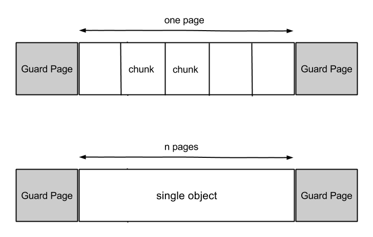

% protect { crypto data }
% Sébastien Martini – seb@dbzteam.org


# Disclaimer

- Young Rustacean
- Only partial solution, still open problems
    - \*experimental\*, \*experimental\*, \*experimental\*, \*experimental\*, \*experimental\*, \*experimental\*
- Experimenting with ideas


# Goal

- Protect secrets and crypto data stored in memory
    - Use a memory safe language like Rust
        - Still room for unsafe code (external C code, `unsafe`)
    - Protect memory allocations
    - Implement data containers


# Custom allocator

- General purpose allocators mainly focus on performances
- Need a more specialized allocator
    - Only used for a subset of all allocations
    - Designed for common crypto use cases
- Main types of data used in crypto
    - Secret keys, plaintext messages
    - Crypto data structures, states


# TARS allocator

- Largely inspired by [OpenBSD's malloc](http://anoncvs.estpak.ee/cgi-bin/cgit/openbsd-src/tree/lib/libc/stdlib/malloc.c)
- At a high-level provides a replacement for `malloc` and `free`
- Based on `mmap`, all operations are applied on memory pages


# TARS allocator

- Allocate small chunks on a same page
    - e.g. size of buffers from toy implementations
        - ChaCha: 64 bytes
        - Poly1305: 68 bytes
        - Sha3: 200 bytes
        - Curve41417: 208 bytes
- Fine-grained access control
    - Modify memory protections on buffers
    - None, Read, Write
- Destroy-on-free


# TARS allocator




# ProtBuf

- Protected Buffer
- Fixed-length array
- Read/write access to its memory
- Take an `Allocator` as type parameter (*pluggable* allocator)
- Default allocator
    - Adapted for handling internal crypto buffers
    - Small allocated chunks may share a same page
    - Empty page chunks may be cached


# Example

```rust
let mut buf: ProtBuf<u8, ProtectedBufferAllocator> =
   ProtBuf::new_zero(42);

assert!(buf[21] == 0);

// Slices are very useful for accessing raw memory
my_function(buf.as_mut_slice());
```


# ProtKey

- Protected Key
- Basically a `ProtBuf` with restricted memory accesses
- Instantiated by taking ownership of a `ProtBuf`
- Use a different allocator
- No caching, page never shared between chunks
- Require explicit requests to access memory
    - Deny all accesses by default
    - RAII


# Example

```rust
let buf: ProtBuf::<u8, ProtectedKeyAllocator> =
   ProtBuf::new_rand_os(32);

let key = ProtKey::new(buf);

key.read_with(|k| encrypt(k.as_slice(), b"abc"));
```


# Open issues

- Hard to control LLVM code generation, optimizations
    - `memset` calls may be optimized-out from generated code
        - Currently use `intrinsics::volatile_set_memory`
    - Data may be copied to temporary variables on the stack
        - `buf3[0] = buf1[0] + buf2[0]`
        - Should we use inline assembly? genericity? portability?
    - May produce different results on different archs
    - Implementations may evolve
- High-level language constructions abstract details
    - Hard to anticipate when/how data is copied


# Others limitations

- New code, lot of `unsafe`
- Limited testing, only on *x86*, *x86_64*
- Not compatible with Windows (not planned)
- Currently not expected to interface well from C
    - `panic!` on error
- Slow compared to general purpose allocators
    - Calls to `mmap`, `memset`, `mprotect` are expensive


# Ready to roll

- Project TARS available on Github
    - [https://github.com/seb-m/tars](https://github.com/seb-m/tars)
- Feedbacks are welcome
